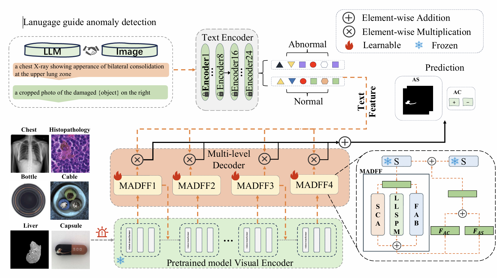
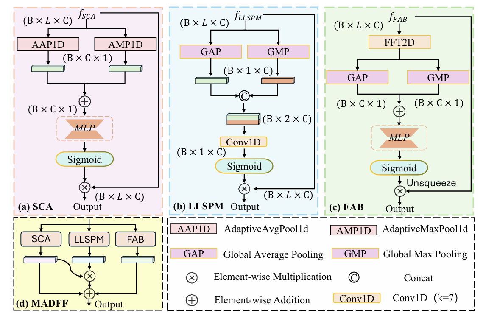
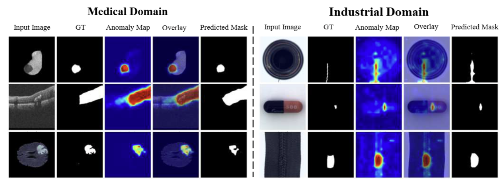

🤖 ClipMPCAD
Few-Shot Anomaly Detection with LLM-Guided Prompts and Multi-Attention Fusion
📖 Abstract
An official PyTorch implementation of “Few-Shot Anomaly Detection with LLM-Guided Prompts and Multi-Attention Fusion”.
Anomaly detection in medical and industrial images often faces challenges such as limited data availability and strict privacy constraints, which hinder large-scale model training. Although pre-trained large vision-language models (VLMs) offer promise in few-shot anomaly detection (FSAD), their effectiveness is limited by weak cross-modal alignment, insufficient domain-specific supervision, and poor sensitivity to fine-grained local anomalies. To address these issues, we propose ClipMPCAD, a CLIP-based framework for cross-domain FSAD that integrates large language model (LLM)-guided prompts and multi attention mechanisms. Specifically, we introduce: (1) a Multi-Attention Driven Feature Fusion (MADFF) module that enhances spatial-frequency awareness and channel-level attention for precise localization; and (2) a Multi-level Semantic Decoder (M-Decoder) combined with Professional domain Prompts (P-Prompts)—LLM-generated, domain-adaptive textual embeddings that guide hierarchical visual-text alignment. Experiments on nine diverse datasets demonstrate the effectiveness of ClipMPCAD, achieving average classification & segmentation accuracies of 90.78% and 98.67% on medical data and 93.11% and 97.54% on industrial data, setting new benchmarks in cross-domain FSAD without additional fine-tuning.
Keywords: Few-Shot, Large Vision-Language Model, Anomaly Classification and Segmentation
 

 

🚀 Get Started
⚙️ Environment
python >= 3.8.5
pytorch >= 1.10.0
torchvision >= 0.11.1
numpy >= 1.19.2
scipy >= 1.5.2
kornia >= 0.6.1
pandas >= 1.1.3
opencv-python >= 4.5.4
pillow
tqdm
ftfy
regex
Note: The code was tested on a single NVIDIA A40 GPU.
⬇️ Pretrained Models
Download the CLIP model and place it in the specified directory.
CLIP: https://openaipublic.azureedge.net/clip/models/3035c92b350959924f9f00213499208652fc7ea050643e8b385c2dac08641f02/ViT-L-14-336px.pt
Put the downloaded file under CLIP/ckpt folder.
📊 Datasets
(Optional) Follow the BMAD instructions to get dataset access.
Download the pre-processed benchmark datasets below:
Liver: ----------------------------------------------------------------------------------
Brain: ----------------------------------------------------------------------------------
HIS: ----------------------------------------------------------------------------------
RESC: ----------------------------------------------------------------------------------
OCT17: ----------------------------------------------------------------------------------
ChestXray: ----------------------------------------------------------------------------------
Mvtec-AD: ----------------------------------------------------------------------------------
MPDD: ----------------------------------------------------------------------------------
BTAD: ----------------------------------------------------------------------------------
Place them inside the data directory and unzip them.
tar -xvf Liver.tar.gz
tar -xvf Brain.tar.gz
tar -xvf Histopathology_AD.tar.gz
tar -xvf Retina_RESC.tar.gz
tar -xvf Retina_OCT2017.tar.gz
tar -xvf Chest.tar.gz
tar -xvf Mvtec.tar.gz
tar -xvf MPDD.tar.gz
tar -xvf BTAD.tar.gz

📂 File Structure
├─ ckpt
│  ├─ few-shot
│  └─ zero-shot
├─ CLIP
│  ├─ bpe_simple_vocab_16e6.txt.gz
│  ├─ ckpt
│  │  └─ ViT-L-14-336px.pt
│  ├─ clip.py
│  ├─ model.py
│  ├─ models.py
│  ├─ model_configs
│  │  └─ ViT-L-14-336.json
│  ├─ modified_resnet.py
│  ├─ openai.py
│  ├─ tokenizer.py
│  └─ transformer.py
├─ data
│  ├─ Brain_AD
│  │  ├─ valid
│  │  └─ test
│  ├─ ...
│  └─ Retina_RESC_AD
│     ├─ valid
│     └─ test
├─ dataset
│  ├─ fewshot_seed
│  │  ├─ Brain
│  │  ├─ ...
│  │  └─ Retina_RESC
│  ├─ medical_few.py
│  └─ medical_zero.py
├─ loss.py
├─ prompt.py
├─ readme.md
├─ train_few.py
├─ train_zero.py
└─ utils.py

🔬 Usage
Quick Start
To test on the Brain MRI with few-shot number k=4, simply run:
python test_few.py --obj Brain --shot 4

Training
To train on the Brain MRI with few-shot number k=4, simply run:
python train_few.py --obj Brain --shot 4

✨ Visualization
 

 
🙏 Acknowledgements
We borrow some codes from OpenCLIP, and April-GAN.
📧 Contact
If you have any problem with this code, please feel free to contact **** and ****.
